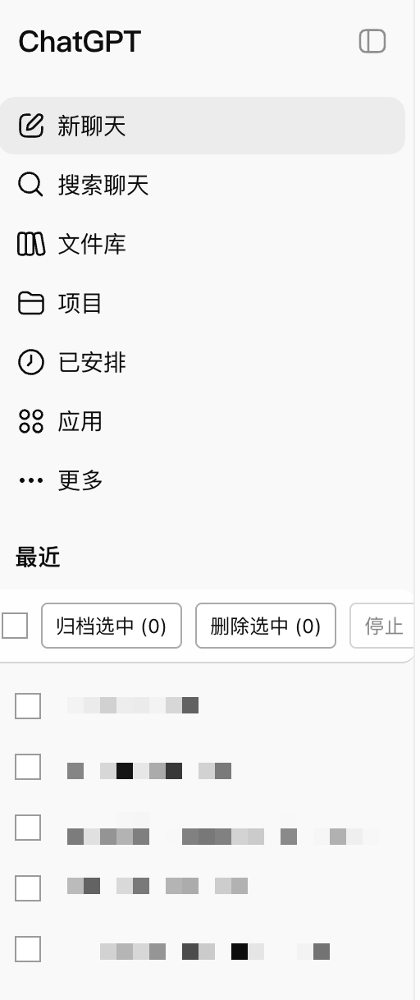
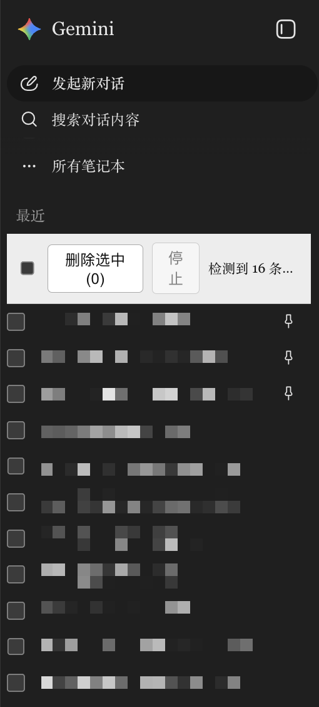

# AI Chat Bulk Manager

AI Chat Bulk Manager is a Tampermonkey userscript that helps you select and manage multiple ChatGPT or Gemini conversations from the sidebar.

It is built for people who have too many AI chat histories and do not want to archive or delete them one by one.

## Install

Most users should install the published Greasy Fork version.

1. Install a userscript manager:
   - [Tampermonkey official download page](https://www.tampermonkey.net/)
2. Install this script:
   - [AI Chat Bulk Manager on Greasy Fork](https://greasyfork.org/zh-CN/scripts/584604-ai-chat-bulk-manager)
   - [Direct install link](https://update.greasyfork.org/scripts/584604/AI%20Chat%20Bulk%20Manager.user.js)
3. Refresh ChatGPT or Gemini.

After installation, open one of these pages:

- [ChatGPT](https://chatgpt.com/)
- [Gemini](https://gemini.google.com/app)

## What It Looks Like

These screenshots show the controls after the script is installed and the chat history list has loaded.

  
  

## How To Use

### ChatGPT

The script adds checkboxes and a control bar above the sidebar conversation list.

1. Open [ChatGPT](https://chatgpt.com/).
2. Tick the conversations you want to manage.
3. Click `Archive selected / 归档选中` to archive or `Delete selected / 删除选中` to remove them from the visible list.
4. Confirm the prompt if you choose delete.

ChatGPT delete is a user-facing delete. The conversation disappears from the normal sidebar list.

### Gemini

The script adds checkboxes and a control bar above the history list.

1. Open [Gemini](https://gemini.google.com/app).
2. Tick the conversations you want to delete.
3. Click `Delete selected / 删除选中`.
4. Confirm the prompt.
5. Keep the tab open while the script deletes conversations one by one.

## Safety Notes

- Bulk delete asks for confirmation before it starts.
- Try it on one or two unimportant conversations first.
- Keep the page open until the batch finishes.
- The script only runs on ChatGPT and Gemini.
- The script does not send your data to any third-party server.

## 中文说明

AI Chat Bulk Manager 是一个用于 ChatGPT 和 Gemini 的油猴脚本。它会在左侧历史会话列表里加入多选框，让你一次选择多条会话，然后批量归档或删除。

### 安装

普通用户建议直接安装 Greasy Fork 发布版。

1. 先安装用户脚本管理器：
   - [Tampermonkey 官方下载页](https://www.tampermonkey.net/)
2. 再安装本脚本：
   - [Greasy Fork 发布页](https://greasyfork.org/zh-CN/scripts/584604-ai-chat-bulk-manager)
   - [直接安装链接](https://update.greasyfork.org/scripts/584604/AI%20Chat%20Bulk%20Manager.user.js)
3. 刷新 ChatGPT 或 Gemini。

安装后打开：

- [ChatGPT](https://chatgpt.com/)
- [Gemini](https://gemini.google.com/app)

### 界面效果

下面两张图展示的是脚本安装完成后，在左侧历史会话列表里出现的多选框和控制条。

  
  

### ChatGPT 怎么用

脚本会在左侧会话列表上方加入控制条，并在每条会话旁加入多选框。

1. 打开 [ChatGPT](https://chatgpt.com/)。
2. 勾选要处理的会话。
3. 点击 `Archive selected / 归档选中` 批量归档，或点击 `Delete selected / 删除选中` 从可见列表移除。
4. 如果选择删除，再确认一次弹窗。

ChatGPT 的删除是用户层面的删除：会话会从正常侧边栏里消失。

### Gemini 怎么用

脚本会在左侧历史记录上方加入控制条，并在每条记录旁加入多选框。

1. 打开 [Gemini](https://gemini.google.com/app)。
2. 勾选要删除的会话。
3. 点击 `Delete selected / 删除选中`。
4. 确认弹窗。
5. 删除过程中保持页面打开，脚本会逐条执行删除。

### 注意事项

- 批量删除前会弹确认框。
- 第一次建议先选 1 到 2 条不重要的会话测试。
- 批量运行时不要立刻关闭页面。
- 这个脚本只在 ChatGPT 和 Gemini 页面运行。
- 脚本不会把你的数据发送到第三方服务器。

## For Developers

Use the Greasy Fork version unless you are developing or testing local changes.

Manual local install:

1. Open the Tampermonkey dashboard.
2. Create a new script.
3. Copy everything from [`src/index.user.js`](src/index.user.js).
4. Paste it into Tampermonkey and save.
5. Refresh ChatGPT or Gemini.

Implementation notes are in [`spec.md`](spec.md). Maintenance steps are in [`plan.md`](plan.md).

## License

MIT
